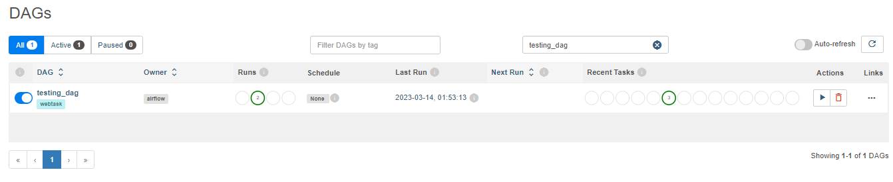
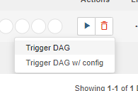
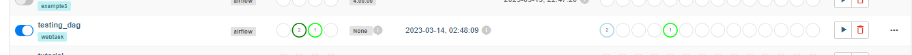
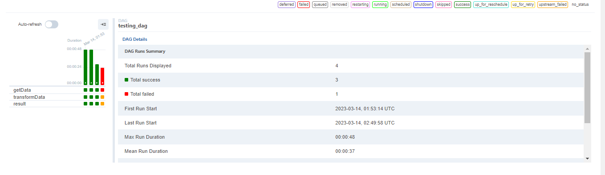
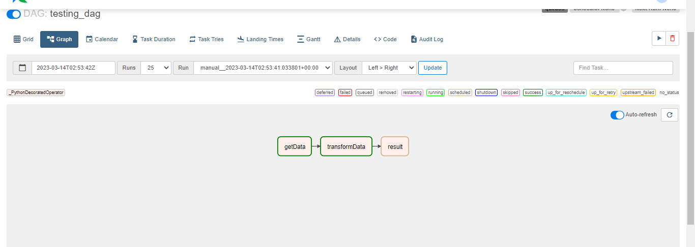

#### Jonathan Isaac Garcia Huerta
#### Computacion Tolerante a Fallas
#### CUCEI

# AirFlows
### Introduccion
Usualmente cuando se realiza una operacion pueden haber varias tecnologicas que puedan ser utilizadas con el mismo proposito, pero usualmente puede haber diferencias entre le uso de una y el uso de otra, y principalmente en esta practica se intentara comparar el uso de AirFlow con Prefect y ver que tanto en la diferencia en la comodidad para usar este.

### Desarrollo
Para poder realizar una correcta comparacion la practica actual se basa en la practica anterior que estaba basada en prefect, este programa obtiene el valor del dolar y como no se me ocurria en que compararlo o usarlo directamente lo multiplique por 20 para simular un ahorro y ver cuanto esta fluctuando para ver cuando conviene venderlo.

De principio de las principales diferencias al momento de estar desarrollando el codigo de prefect a Airflow es que en airflow al momento de estructurar las tareas no se separar directamente del flujo de las tareas.
Siendo asi que la estrucutra del codigo es la siguiente:

primero empezando con las definicion de los datos de nuestro dag
``` python
@dag(
    dag_id="testing_dag",
    schedule=None,
    start_date=datetime(2023, 3, 13),
    tags=["task"],
)
```

Posteriormente agregamos el flujo con cada una de las tareas
``` python
def main():
    @task()
    def getData():
        url = 'https://www.banxico.org.mx/tipcamb/tipCamMIAction.do'
        response = requests.get(url)
        soup = BeautifulSoup(response.content, 'html.parser')

        data = soup.find('tr', {'class': 'renglonNon'})
        datas = data.find_all('td')

        return float(datas[-1].text.strip())

    @task()
    def transformData(data):
        Savings = 20
        return 20 * data

    @task()
    def result(res):
        msg = "Actualmente los dolares ahorrados son: " + str(res)
        with open("ahorro.txt", 'a') as f:
            f.write(msg)
        return msg

    data = getData()
    res = transformData(data)
    print(result(res))
```

Con esto se lo agregamos a airflow y iniciamos el schedouler y webservice se Airflow para poder iniciar la pagina de Airflow

Una vez activa e iniciada sesion buscamos especificamente el nuesto dags



Aqui tenemos nuestro DAG de airflow donde posteriormente lo ejecutamos

y aqui se puede ver como se esta realizando la ejecucion


Pero para mostrar el us provacamos un error en este

Ahora verificamos el dag para verificar el contenido, primero teniendo las estadisticas de la ejecucion del dag



Mostrando las ejecuciones anteriores que se ejecutaron correctamente con esta ultima la cual sucedio un error, entonces mostramos la estructura del diagrama.


Se muestra exactamente donde sucedio el error, aparte de dar los estados de cada proceso en el que se quedaron, que almenos como en mi caso la estructura es secuencial realmente al fallar uno el resto quedo en espera al ya no poder seguirse ejecutandose, por esto mismo volvi a ejecutar una vez mas, pero ahora intentando mostrar los diagramas cuando esta a medias pero correcto.



Con esto mostramos el avance que tiene comparando las mismas tareas de Airflow con las que puede hacer prefect

### Conclusiones

Airflow es una herramienta bastante completa solo aunque tal vez por mi inexperiencia usando python se me complicaron ciertas partes, o que simplmenete durante el desarrollo de esta misma tenia el problema que para poder correr airflow si o si tenia que hacer un subsistema linux para que puediera correr airflow, mientras que prefect aunque no logre sacarle la pagina igual podia correr desde consola sin necesidad de hacer un subsistema, siendo que aunque prefect y Airflow manejen los mismos, Siento que airflow puede estar mas dedicado a proyectos mas grandes de los que pueda manejar prefect, pero puede ser que no tenga la perspectiva completa de prefect al no usarlo tan con desde la pagina que hostean al hacer el webservice.

