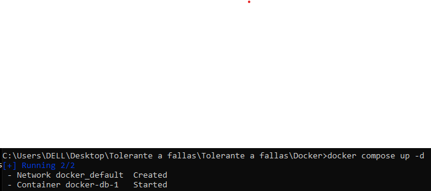
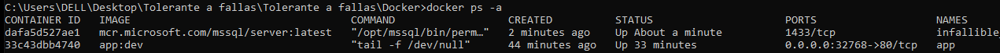
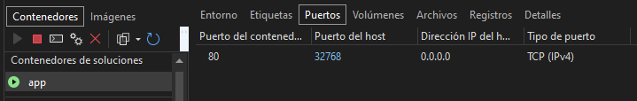

#### Jonathan Isaac Garcia Huerta
#### Computacion Tolerante a Fallas
#### CUCEI

# Docker
### Introduccion
Para esta practica es necesario realizar una practica la cual se utilice la herramienta docker para la creacion de contenedores, en la cual aunque no soy muy creativo ante esta situacion, lo que se va a desarrollar durante la practica es la creacion de un contenedor para una app y otro contenedor para habilitar Microsoft SQL server, utilizando principalmente .Net Core.

### Contenido
Primero para el uso general de la aplicacion se utiliza una web app de .Net Core, primero se tiene que configurar nuestro contenedor, lo cual se hizo de esta forma, utilizando como referencia como se usaban los dockerfiles de algunos proyectos de Git de net core

```
FROM mcr.microsoft.com/dotnet/aspnet:6.0 AS base
WORKDIR /app
EXPOSE 80

FROM mcr.microsoft.com/dotnet/sdk:6.0 AS build
WORKDIR /src
COPY ["Docker/app/app.csproj", "Docker/app/"]
RUN dotnet restore "Docker/app/app.csproj"
COPY . .
WORKDIR "/src/Docker/app"
RUN dotnet build "app.csproj" -c Release -o /app/build

FROM build AS publish
RUN dotnet publish "app.csproj" -c Release -o /app/publish /p:UseAppHost=false

FROM base AS final
WORKDIR /app
COPY --from=publish /app/publish .
ENTRYPOINT ["dotnet", "app.dll"]
```

Posteriormente se configura nuestra aplicacion, se va a utilizar un servidor de MS SQL server lo cual en mi caso no poseo, pero con un archivo de docker-compose es posible descargar el contenedor de MS SQL mientras al momento de usarlo.

```
services:
  web:
    build: app
    ports:
      - 80:80
  db:
    environment:
      ACCEPT_EULA: "Y"
      SA_PASSWORD: example_123
    image: mcr.microsoft.com/azure-sql-edge:1.0.4
    image: mcr.microsoft.com/mssql/server
    restart: always
    healthcheck:
        test: ["CMD-SHELL", "/opt/mssql-tools/bin/sqlcmd -S localhost -U sa -P example_123 -Q 'SELECT 1' || exit 1"]
        interval: 10s
        retries: 10
        start_period: 10s
        timeout: 3s     
```

Posteriormente para empezar ambos contenedores se utilza docker compose
``` 
docker compose up -d
```



Comprobado desde la consola que nuestros contenedores estan se utiliza docker ps -a.



Posteriormente para verificar que nuestra web app esta ejecutandose correctamente es entrar al localhost en el puerto asignado, en mi caso 32768


Tambien podemos ver los datos de los contenedores corriendo desde una herramienta integrada en Visual Studio.



Tambien utilizando el propio Visual estudio se puede realizar un ejecutable que permita 
### Conclusion
Para el desarrollo de esta practica fue principalmente investigar la diferencia entre un contenedor y una maquina virtual y principalmente fue bastante lo que encontre al respecto de porque un contenedor es mas ligero, puesto que un contenedor solo corre desde un modo usuario sin necesidad de generar nada extra, mientras que la VM tiene que generar hasta su propio kernel siendo bastante mas ligero de utilizar, pero al menos en mi caso mientras estaba haciendo pruebas con los contenedores, no se porque pero en algun punto se termina consumiendo toda la ram de mi computadora en el "sistema", asi que tal vez estaba haciendo algo de una forma incorrecta que no encontre que estaba haciendo mal lo que me forzaba a reiniciar despues de una de bastantes pruebas, pero quitando esta parte es bastante interesante como se puede ejecutar desde un entorno aislado sin la necesidad de tener que ejecutar una VM, cumpliendo la funcionalidad de la que esperaria usar una VM durante el desarrollo desde una forma mas optima. Tal vez donde en esta practica no se consigui los resultados esperados puesto que no se logro conectar la app con SQL server me agrado docker para la creacion contenedores y tal vez lo utilizare mas adelante al momento de realizar pruebas en futuros proyectos.