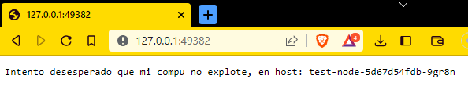

#### Jonathan Isaac Garcia Huerta
#### Computacion Tolerante a Fallas
#### CUCEI

# Kubernetes
Usualmente en la toleracia a fallas implica poder tener activo los servicios independientemente de los problemas que se puedan tener el entorno, para esto se necesita ver cual puede ser una de las herramientas que permitan la tolerancia a fallas, cuando se implementan contenedores de docker, donde en estas situaciones es bueno tener kubernetes como un orquestador de contenedores para que aunque sucedan errores se puedan matener una disponibilidad en el servicio.


## Preguntas
### **¿Que es Kubernetes?**
Kubernetes (referido en inglés comúnmente como “K8s”) es una plataforma de sistema distribuido de código libre para la automatización del despliegue, ajuste de escala y manejo de aplicaciones en contenedores​ que fue originalmente diseñado por Google y donado a la Cloud Native Computing Foundation (parte de la Linux Foundation).
### **¿Que es Ingress?**
La opción de Ingress Controllers en Kubernetes se refiere a un tipo de balanceador de carga especializado para la plataforma, así como otros entornos relacionados con contenedores.

Esta opción se implementa con el objetivo de gestionar el tráfico de salida en el interior de un clúster para los servicios que necesitan comunicarse con otros por fuera del mismo clúster.
### **¿Que es LoadBalancer?**
 Expone el Service externamente usando el balanceador de carga del proveedor de la nube. Son creados automáticamente Services NodePorty ClusterIP, a los cuales el apuntará el balanceador externo.
 En proveedores de la nube que soportan balanceadores de carga externos, establecer el campo type a LoadBalancer aprovisiona un balanceador de carga para tu Service. La creación del balanceador de carga ocurre de forma asíncrona, y la información sobre el balanceador de carga provisto se publica en el campo .status.loadBalancer del Service.

Para realizar esta practica por cuestiones de falta de una tarjeta de credito para poder realzar el deployment en un servicio de cloud computing directamente se opto por realizarlo con minikube, aunque esto provoco problemas posteriores al solo tener 8GB de ram.

La aplicacion realizada es una aplicacion simple que muestra un mensaje y el nombre pod en que esta

``` javascript
var http = require('http');
var request=0;
var podname = process.env.HOSTNAME;
var startTime;
var host;
var handleRequest = function(request, response){
    response.setHeader('Content-Type', 'text/plain');
    response.write("Intento desesperado que mi compu no explote, en host: ");
    response.write(host);
    response.end("\n");
    console.log("Host :", host, "| Total Requests: ", ++request, "| App Uptime:", (new Date() - startTime/1000 , "seconds", "| log time:", new Date()));
}
var www = http.createServer(handleRequest);
www.listen(8080,function(){
    startTime = new Date();;
    host = process.env.HOSTNAME;
    console.log("Aplicacion iniciada en: [",startTime,"] | Host: [",host,"]\n");
})
```

Posteriormente para poder realizar el contenedor, tambien el Dockerfile.

``` Dockerfile
FROM node:4.4
EXPOSE 8080
COPY server.js .
CMD node server.js
```
Posteriormente crear el contenedor


Confirmando que se creara correctamente la imagen.


Despues crear minikube para poder realizar el uso de kubernetes, donde al realizarse desde un equipo un poco mas limitado fue puesto previamente de solo consumir lo minimo que permite minikube


Posteriormente teniendo el setup hecho realizamos el deployment en kubectl


Mostrando asi el como se creo el deployment, pero paso un error en el codigo, pero ayuda a mostrar un ejemplo de como se ve cuando esta caido y los contenedores que se han remplazado.


Posteriormente se corrigio este error y se pudo realizar el deploy correctamente.

Cambiando la imagen del contenedor

Cambiar el deploy 


Posteriormente mostramos los servicios que poseemos en el kubectl


Posteriormente al momento de conseguir la direccion para poder acceder al servicio, se necesitaba un acceso del cual no conocia la contraseña y habia muy poca documentacion al respecto


Al tener tan poca documentacion, mejor directamente cambie la contraseña al no encontrar ninguna contrasela por defecto


 Posteriormente se realiza completa con la contresaña

 

 Posterirmente con todos los errores pasos necesarios se completo poder obtenerlo.

 

 confirmando que el numero que muestra es el correcto para verificar por un ultimo momento el funcionamiento correcto.

 

 ## Conclusiones

El realizar esta practica fue bastante complicado por las limitaciones en RAM del equipo y buscar poder realizar optimizaciones para poder realizarlo de una forma correcta, lo cual termino pasando el leer gran parte de la documentacion de minikube y kubernetes por todos los errores, donde no se si todos estos sucedieron por las limitaciones tecnicas o por la configuracion, pero aun asi se logro configurar y funcionar, donde en parte por los errores sucedidos pude ver como se realizaban estos, pero tal vez pudo ser mejor poder poner varios contenedores para mostrar al momento de tener errores mostrar el cambio del contenedor, pero no se pudo mostrar por lo bastante ya mencionado de las limitaciones tecnicas, pero para trabajar con microservicios y poder tener contenedores en espera para poder realizar un servicio continuo.