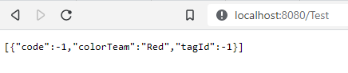
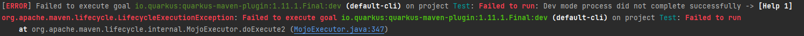

#### Jonathan Isaac Garcia Huerta
#### Computacion Tolerante a Fallas
#### CUCEI

# MicroProfile Quarkus
### Introduccion
Para la implementacion de microservicios es bueno intentar utilizar un control para poder proporcionar una tolerancia a fallos, por esto mismo para una preparacion para el uso de kubernetes se puede ir realizando una implementacion de lo que es un micro servicio desde Quarkus y microprofile y con ayuda de PostMan ayudar en la prueba de estos

### Contenido
#### **¿Que es Java EE?**
Java Platform, Enterprise Edition (Java EE) se basa en la especificación Java SE. Representa una colaboración entre varios proveedores y líderes del sector y proporciona el soporte de la infraestructura para las aplicaciones.

Java EE es portable y escalable, y soporta la integración existente y los componentes basados en la arquitectura EJB. Java EE simplifica las aplicaciones empresariales definiendo y especificando un complejo conjunto de servicios estándar comunes, como denominación, gestión de transacciones, simultaneidad, seguridad y acceso a base de datos.

#### **¿Que es Java SE?**
Java Platform, Standard Edition (Java SE) es una especificación que describe una plataforma Java de resumen. Proporciona una base para crear y desplegar aplicaciones de negocio centradas en la red que van desde un ordenador de escritorio PC a un servidor de grupo de trabajo. Java SE lo implementa el kit de desarrollo de software (SDK) Java.

#### **¿Que es Jakarta EE?**
En 2017 Oracle decide que deja de controlar el desarrollo de Java EE y decide pasarlo a la comundidad para que sea guiado en un proceso más abierto y flexible por la Eclipse Foundation. Manteniendo el modelo de JCP que se seguía en su desarrollo.

Si bien en este proceso de traspaso se decide no pasar la marca Java EE y la comunidad tiene que renombrar el proyecto a Jakarta EE.

#### **¿Que es MicroProfile?**
Eclipse MicroProfile es una colección de librerías Java EE y tecnologías que juntas forman la línea base para micro-servicios que apunta a entregar aplicaciones portables a través de múltiples sistemas operativos.

La especificación de MicroProfile 1.0 incluye un conjunto de 30 especificaciones adicionales de JEE y estos son: JAX-RS 2.0 para puntos finales de RESTful, CDI 1.1 para las extensiones e inyección de dependencias y JSON-P 1.0 para procesamiento de mensajes JSON.

#### **¿Que es Spring boot?**
Spring Boot es un framework desarrollado para el trabajo con Java como lenguaje de programación. Se trata de un entorno de desarrollo de código abierto y gratuito.

Facilita el trabajo con otras herramientas como Tomcat, Jetty o Undertow. Lo hace directamente, sin necesidad de implementar archivos específicos para ello.

#### **¿Que es Quarkus?**
Quarkus es un marco integral de Java diseñado para su implementación en Kubernetes y creado para las compilaciones propias y las máquinas virtuales Java (JVM). Permite optimizar Java especialmente para los contenedores y los entornos sin servidor, de nube y de Kubernetes.

#### **¿Que es Maven?**
Es una potente herramienta de gestión de proyectos que se utiliza para gestión de dependencias, como herramienta de compilación e incluso como herramienta de documentación. Es de código abierto y gratuita.

#### **¿Que es Gradle?**
Gradle, es una herramienta que permite la automatización de compilación de código abierto, la cual se encuentra centrada en la flexibilidad y el rendimiento. Los scripts de compilación de Gradle se escriben utilizando Groovy o Kotlin DSL (Domain Specific Language).
Tambien utilizando el propio Visual estudio se puede realizar un ejecutable que permita

En mi ocacion el objeto que voy a estar moviendo es un Tag, donde no se me ocurrio mucho, donde simplmente se genera un ID, un codigo y aleatoriamente a que equipo pertenece, por lo cual simplemente el objeto.

``` java
public class Tag {
    private Long tagId;
    private Long code;
    private String colorTeam;

    public Tag(Long personId, Long code, String color) {
        this.tagId = personId;
        this.code = code;
        this.colorTeam = color;
    }

    public Long getTagId() {
        return tagId;
    }

    public void setTagId(Long tagId) {
        this.tagId = tagId;
    }

    public Long getCode() {
        return code;
    }

    public void setCode(Long code) {
        this.code = code;
    }

    public String getColorTeam() {
        return colorTeam;
    }

    public void setColorTeam(String colorTeam) {
        this.colorTeam = colorTeam;
    }
}
```

posteriormente para el control de este simplemente realice igual solo por el get para confirmar que se estaba ejecutando correctamente

``` java
@Path("/Test")
@Produces(MediaType.APPLICATION_JSON)
public class TestController {

    List<Tag> tagList = new ArrayList<>();
    Logger LOGGER = Logger.getLogger("Demologger");

    @GET
    @Retry(maxRetries = 4)
    @CircuitBreaker(failureRatio = 0.1, delay = 15000L)
    @Bulkhead(value = 0)
    @Fallback(fallbackMethod = "getTagFallbackList")
    public List<Tag> getTagList(){
        LOGGER.info("Ejecutando");
        doFail();
        //doWait();
        return this.tagList;
    }

    public List<Tag> getTagFallbackList(){
        var Tag = new Tag(-1L, -1L, "Red");
        return List.of(Tag);
    }

    public void doWait(){
        var random = new Random();
        try {
            LOGGER.warning("sleep");
            Thread.sleep((random.nextInt(10) + 4) * 1000L);
        }catch (Exception ex){

        }
    }

    public void doFail(){
        var random = new Random();
        if(random.nextBoolean()){
            LOGGER.warning("falla");
            throw  new RuntimeException("Implementacion fallo");
        }
    }

}
```

donde simplemente se realiza como lo visto en el video se realiza simplemente un GET, donde simplemente se puede intercambiar el doWait con el doFail para simular algun error, pero por cuestiones de tiempo y al momento de intentar implementar el meotodo POST para intentar meter mas datos al momento de intentar probar un poco mas, nada mas sucedian errores de compilacion que no logre solucionar.



Tambien para mostrar el log ejecutando maven en forma debug obtenia problemas con las versiones, lo cual no me permitio poder realizarlo desde el debug, pero si se podia realizar compilando desde el proyecto.




### Conclusion
Aunque en el proyecto por errores no logre consegui mostrar el log realmente se alcanza un poco con pruebas a intentar que aunque se mantengan errores se pueda mantener en ejecucion considerando en microservicios, todo pueda ejecutarse de forma independiente para poder realizar un codigo de forma mucho mas robusta, y es interesante tener tantas herramientas que ayudan para el uso de microservicios, pero es una lastima no poder solucionar los errores de estos probablemente por cuestiones de JDK o por usar como tal open JDK, pero igual es interesante intentar extrapolar este conocimiento de microservicios a otros lados.
