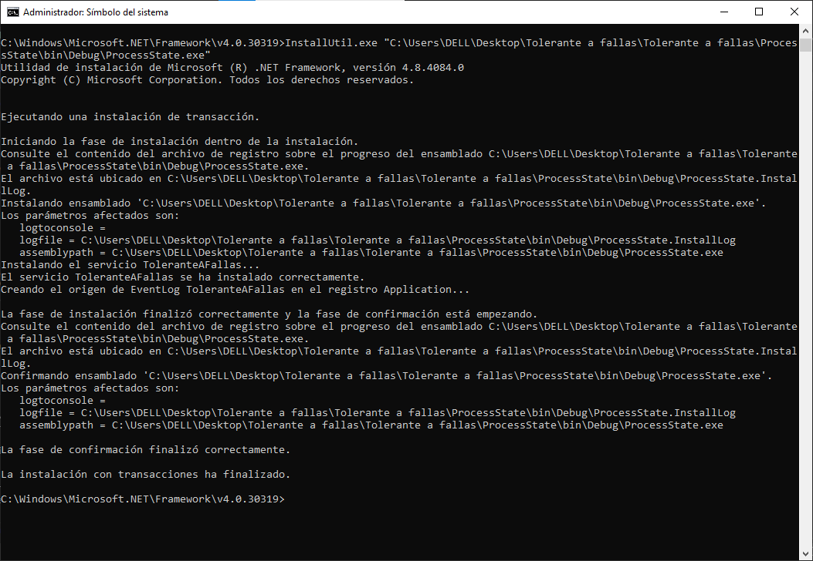
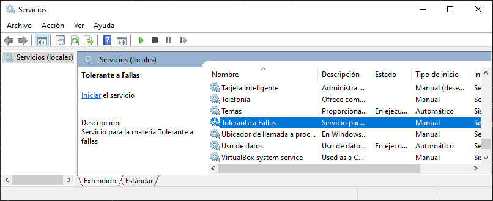
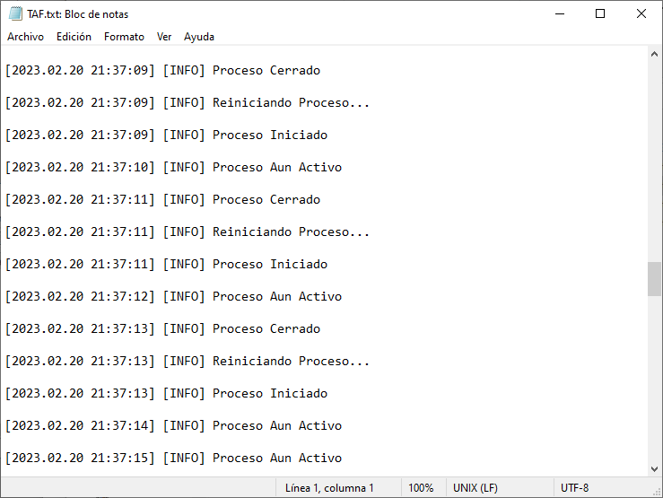

#### Garcia Huerta Jonathan Isaac
# ProcessState
### Introduccion
hay ocaciones en las que es necesario realizar un proceso de forma periodica pero si la necesidad de una interaccion con un usuario, alguna de estas acciones pueden ser simplemente volver a levantar un servidor o estar verificando de forma periodica ciertas acciones, pues para esto esta practica constara de como realizar un proceso con.Net y InstallUtil para crear un nuevo proceso en windows.
### Desarrollo
Para poder realizar esta practica lo primero es realizar una servicio que simplmente se puede crear un proyeto de servicio de windows en .Net, para el desarrollo de detectar el proceso se puede utilizar una clase especifica que es proceso que nos permite hacer acciones para el proceso en cuestion que da herramientas que para poder verificar y manipular un proceso, de lis comandos que nos interesan para el desarrollo de esta practica es Start() y HasExited, simplemente para empezar el proceso es necesario utilizar Start() y para verificar si el proseso fue cerrado con HasExited.

``` C#
try
{
    proceso.Start();
    AddtoLog("Proceso Iniciado");

}
catch (Exception)
{
    AddtoLog("No se encontro el proceso");
}
```

``` c#
if (proceso.HasExited)
{
    AddtoLog("Proceso Cerrado");
    AddtoLog("Reiniciando Proceso...");
    StartProcess();
}
else 
{
    AddtoLog("Proceso Aun Activo");
}
```

Esto es como funciona, pero para poder realizar la instacion como servicio es necesario crear una clase instalador y tener un instalador de proceso y un instalador de servicio para poder tenerlo como un servicio de windows, que con la herramienta InstallUtil.exe pasandole como parametro nuestro exe generado con propiamenete un instalador de servicio nos permite tener puesto directamente como un servicio mas en windows



Como se puede observar ahora aparece en los servicios de windows, 



directamente lo iniciamos y se pone en ejecucion


 posteriormente verificar que el proceso este en funcionamiento es necesario comprobar de alguna forma el estado del servicio, por esto mismo hice que el servicio estubiera escribiendo cada segundo en un archivo guardando en temp simplemente para tener un control al no tener ningun tipo de interfaz vinculada al proceso, principalmente para verificar que se estubiera ejecutando bien y poder debuggear en caso de ser necesario, que por suerte no fue necesario

 

 Por ultimo una vez ejecutado el servicio eh se ejecutara automaticamente la ventana de la practica anterior "Checkpoints", que como si fuera un malware, cada vez que lo intentamos cerrar vuelve a ejecutarse, comprobando que fue realizado correctamente.

 Por ultimo como estamos escribiendo en un archivo cada segundo terminamos el programa, y utilizando el mismo InstallUtil pero con \u, es posible desinstalar un servicio realizando esto parar retirar el servicio.

 ### Conclusion

 Este progrma fue bastante completo al momento de entender otra parte de la tolerancia a fallas, puesto que en este caso aunque este mismo servicio simplemente cambiando el ejecutable del proceso puede funcionar como un virus, sirve como experencia para poder desarrollar programas proximanente que no necesiten de una interaccion con el usuario para un correcto funcionamento de estos mismos, con esto generando un correcto funcionamiento de los programas independientemente de que el usuario este al pendiente de los problemas.
