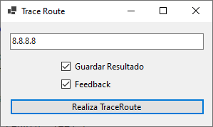
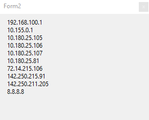
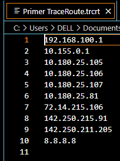

#### Garcia Huerta Jonathan Isaac
# Threads
### Introduccion
Para poder realizar la elaboracion de procesos en los cuales les podamos mandar a realizar procesos que permita que si por algun motivo termina fallando, se pueda volver a hacer desde otro hilo sin perjudicar la ejecucion del proceso principal, siedo esto la base para los sistemas distribuidos en un escalada horizontal.

### Desarrollo

Para poder realizar un proceso que se realice con hilos lo que se me ocurrio que se podria realizar fue hacer Trace Routes, puesto que en ocaciones entre los brincos que puede dat se puede tardar bastante en cada uno, asi que por esto se realiza cada traceRoute desde un Hilo, y el resultado del Trace Route se muestra una vez terminado y tambien da la posibilidad de guadarlo en un archivo, para hacer el trace la parte principal de los pings es la siguiente parte:

``` C#
using (var pinger = new Ping())
{
    for (int ttl = 1; ttl <= maxTTL; ttl++)
    { 
        PingOptions options = new PingOptions(ttl, true);
        
        PingReply reply = pinger.Send(Dest, timeout, buffer, options);

        if (reply.Status == IPStatus.Success || reply.Status == IPStatus.TtlExpired)    
            jumps.Add((reply.Address.ToString(), reply.RoundtripTime));
                        
        if (reply.Status != IPStatus.TtlExpired && reply.Status != IPStatus.TimedOut)
            break;
    }
} 
``` 
En este caso voy registrando sato a salto y jumps es una lista de direcciones IP y tiempos de retorno, que aunque el programa el pingreply solo retorna el tiempo del destino en cuestion y no de todos los saltos, pero igual se puede ir obteniendo el resultado en cada uno de los saltos.

Para la ejecucion del programa primero tenemos una ventana simple que simplemente es ingresar la direccion IP o dominio del cual se quiere hacer un trace Route, si se quiere ver la ejecucion del traceroute y si se quiere guardar el camino del traceroute.



Posteriormente para cada hilo lo que se hace es realizar cada hilo directamente, como en este caso no estoy tratando con diferentes procesos se hace desde un try catch lo que se quiere hacer para el hilo, y en caso de que el hilo termine de una forma inesperada se realiza una ventana para decir que el hilo se murio y aparte mostrar el msg de la excepcion.

Para mostrar como va cada traceroute en caso que tengan activado que de feedback antes de dar el resultado simplemente es una ventana que tiene puesto para ir agregando segun se va realizando cada envio de paquete.



Tambien para la seleccion del archivo en el que se guardara el resultado del traceroute simplemente se utilizo uno de los ventans de seleccion de archivo ya incluidos, solo que los archivos en los que se hizo para guardar el trace route es tipo trcrt o txt, en el que ambos funcionan igual, pero simplemente es para seleccionar donde quedara almacenado el archivo.


Posteriormente lo una vez terminado el proceso del traceroute se mostrara una ventana emergente que muestre todos los saltos independientemente del el feedback o si fue dado guardado, y por ultimo en caso de haber puesto que se guarde en un archivo se muestra en el archivo



Donde para comprobar el efectivo funcionamiento de este programa fue por medio de una conexion limitada, para que se puedan realizar varios pingeos a la vez y se pueda ver el avance de cada uno de los diferentes procesos, pero en cambio con una velocidad internet como la que tenemos actualmente, pero fue lo que se ocurrio para poder realizar este programa.

### Conclusión
La forma en la que se pueden realizar los procesos desde hilos secundarios para no afectar el funcionamiento general del sistema puede ayudar bastante a la computacion tolerante a fallos, pero durante el desarrollo de esta misma practica entendi que por ejemplo pude haber tenido una lista de los traceroute por realizar y en caso de un hilo morir volver a dejar este para que otro hilo lo pudiera ejecutar en caso de hace un throw externo a los pasos del algoritmo, por lo que puede hacer que aunque este muera pueda ser tomado por otro hilo lo pueda tomar.