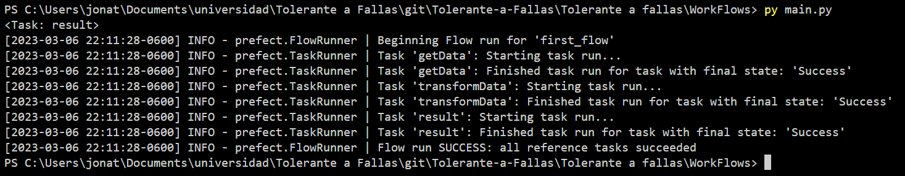
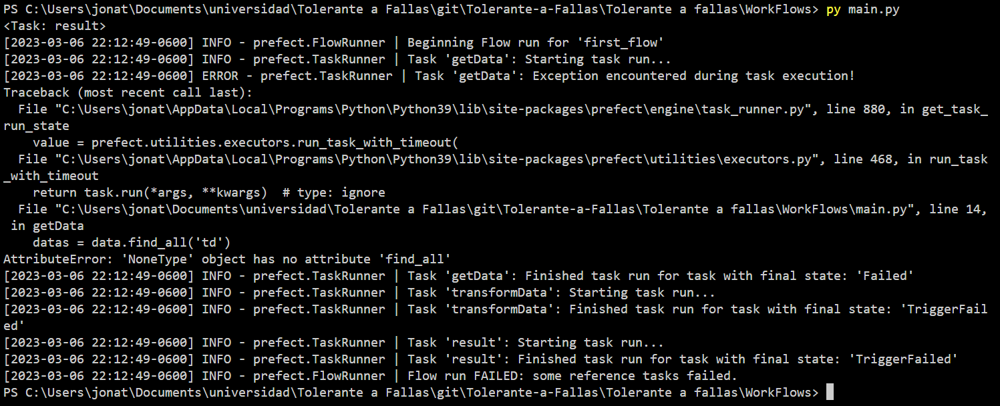

#### Jonathan Isaac Garcia Huerta
# WorkFlow Managers
### Introduccion
Los workflow managers son usados principalmente para verificar la forma en la que se ejecutan nuestros programas, dandonos facilidades para verificar el funcionamiento, aparte de almacenar, programar y verificar los resultados dados tras las ejecuciones. Donde en esto Los WorkFlow Managers son utiles para el control de flujos desde una mediana cantidad de datos, teniando asi una forma sencilla de hacer un trabajo con los Workflows, donde se verificara su uso y sus beneficios.

### Desarrollo
El proximo programa lo que realiza principalmente es el verificar cuanto son 20 dlrs, dando tentativamente dando como unos posibles ahorros y verificar su obtencion de estos, usando principalmente las etapas Extract, Transform y Load.

Primero tenemos que definir nuestras tareas, empezando po la extraccion

``` Python
@task
def getData():
    url = 'https://www.banxico.org.mx/tipcamb/tipCamMIAction.d'
    response = requests.get(url)
    soup = BeautifulSoup(response.content, 'html.parser')

    data = soup.find('tr', {'class': 'renglonNon'})
    datas = data.find_all('td')

    return float(datas[-1].text.strip())
``` 

Posteriormente tenemos nuestra transformacion, en la cual realmente es la situacion de ahorros porque no se me ocurrio hacer nada en especifico.

``` python
@task
def transformData(data):
    Savings = 20
    return 20 * data

``` 
Posteriormente se plantea la carga en la que simplemente se guarda en un archivo
``` python
@task
def result(res):
    msg = "Actualmente los dolares ahorrados son: " + str(res)
    with open("ahorro.txt", 'a') as f:
        f.write(msg)
    return msg
``` 
Por ultimo tenemos que definir el flow del trabajo

``` python
def build_flow():
    with Flow("first_flow") as f:
        data = getData()
        res = transformData(data)
        print(result(res))

    return f
```

Posteriormente solo tenemos qie iniciar prefect

``` python
build_flow().run()
``` 

con esto se muestra la ejecucion del flow y las task de prefect



y en caso de provocar un error, como no poder acceder se muestra de esta forma



### Conclusion
Los workflow managers ayudan demaciado al estar teniendo que manejar grandes cantidades de informacion en ejecuciones, donde principalmente le veo uso es en la Ciencia de Datos puesto al manejar tanta cantidad de informacion ayuda bastante tener una herramienta que te pueda determinar donde sucedio un error, porque sucedio directamente y que aparte siga manteniendo la ejecucion del programa, donde este es muy comodo inclusive porque no se necesito de hacer tan robusto el codigo para que aun posterior a suceder un error pudiera ejecutar el resto del codigo como si nada. Aunque realmente siento que mi inexperiencia con python me genero problemas en intentar usar prefect v2 o que no logre conseguir la version grafica o que se pone en localhost de react intentando con conda, y por un poco dificil de conseguir la informacion al final se termino realizando en la v1 de prefect y solamente con las respuestas que muestra en consola.